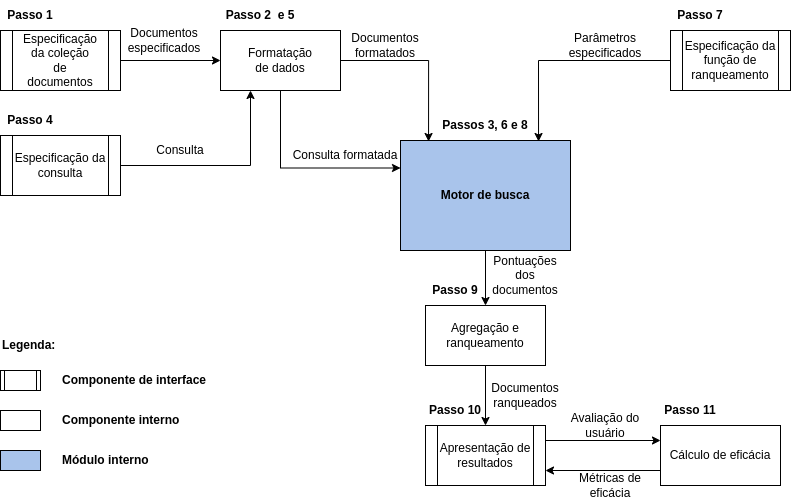
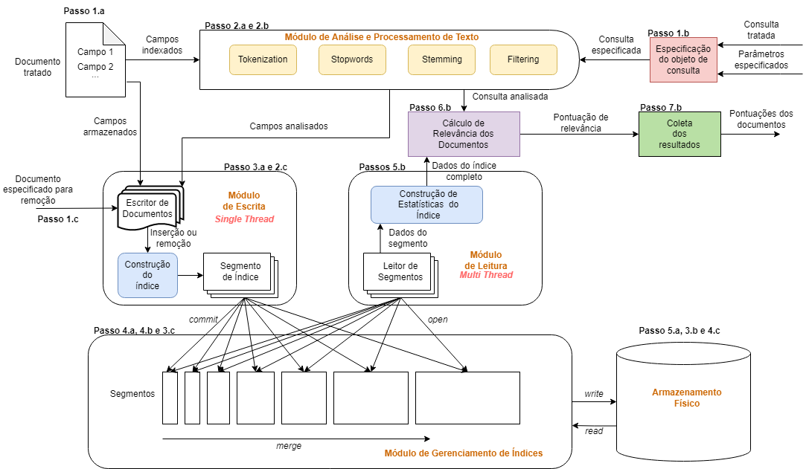
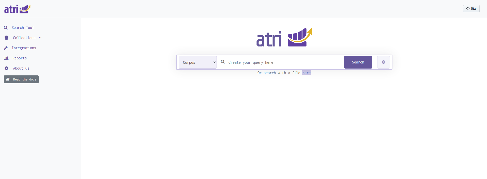
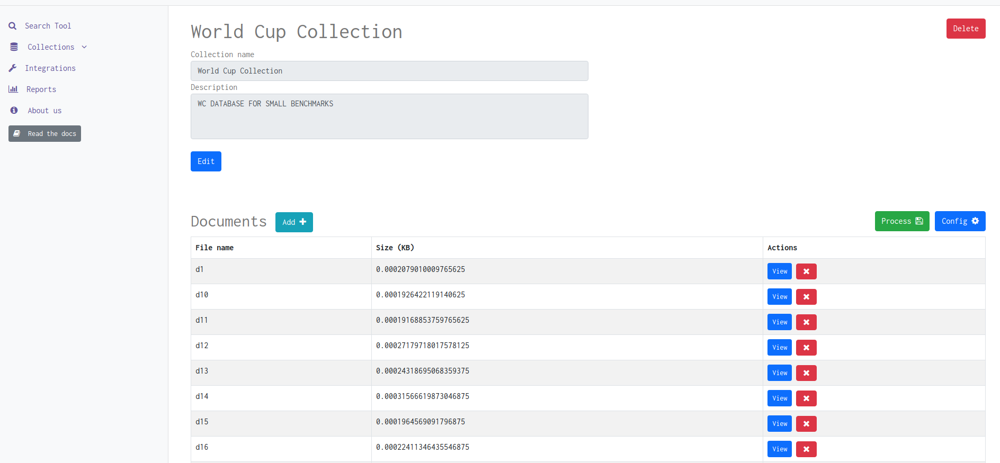
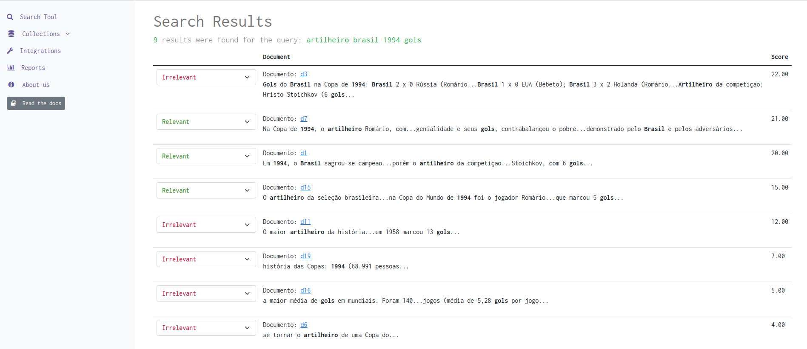

<!-- PROJECT LOGO -->
 

  

  <h3 align="center">atri</h3>

  

    An UI Information Retrieval Tool
     
    <a href=""><strong>Explore the docs »</strong></a>
     
     
    <a href="https://github.com/search-labs/atri/issues">Report Bug</a>
    ·
    <a href="https://github.com/search-labs/atri/issues">Request Feature</a>

<!-- TABLE OF CONTENTS -->

  
Table of Contents

  <ol>
    <li>
      <a href="#about-the-project">About The Project</a>
      <ul>
        <li><a href="#built-with">Built With</a></li>
      </ul>
    </li>
    <li>
      <a href="#architecture">Architecture</a>
    </li>
    <li><a href="#pictures">Pictures</a></li>
    <li><a href="#roadmap">Roadmap</a></li>
    <li><a href="#contributing">Contributing</a></li>
    <li><a href="#license">License</a></li>
    <li><a href="#contact">Contact</a></li>
  </ol>

<!-- ABOUT THE PROJECT -->
## About The Project

In general, ranking algorithms are responsible for deciding, through a query, which documents are relevant or not to it. In this context, in order to guarantee the effectiveness of the returned results, an appropriate modeling of the considered documents and queries is necessary, aiming to adequately produce a ranking function that assigns similarity scores between a query and documents from a collection. To define ranking functions, several Information Retrieval (IR) models were proposed using boolean, vectorial and probabilistic formulations.Each IR model has its own operating assumptions that lead to the rank of documents from a given corpus through desired queries. Thus, this work has, as main objective, the proposal, development, and validation of an experimental IR environment, called ATRI, which includes different IR models to calculate the similarity between queries and documents in a collection through a friendly interface, and could have applications in different scenarios. For this purpose, the following models were considered for similarity calculation: Boolean, Vector Space, Probabilistic, BM25, Belief Network, Extended Boolean, Generalized Vector Space, DFRee, and PL2. In addition, ATRI allows the creation of a benchmarking environment for evaluation of the effectiveness and performance on IR through automatic creation of ensembles, visualization of effectiveness metrics, and support to scientific collections.

### Built With

- Whooshy (My modified fork of Whoosh):
- Python 3.9
- FastAPI

## Architecture

Currently in development. Bellow, we have the high-level architecture written in PT-BR:

And the "Motor de Busca" module can be blown up as:

## Pictures

Currently, that is the interface of [Atri-UI](https://github.com/atri-search/atri_ui):

<h4 align="center">Main page</h4>

<h4 align="center">Collections Management page</h4>

<h4 align="center">Search Results page</h4>

## Roadmap

That is my personal roadmap written in PT-BR.

|                               Atividade                               | Janeiro | Fevereiro | Março | Abril | Maio | Junho |
|:---------------------------------------------------------------------:|---------|-----------|-------|-------|------|-------|
| bugfix: Multiquery: erros de estatísticas erradas                     |    X     |           |       |       |      |       |
|            bugfix: Booleano Estendido com p=3 em multiquery           |    X    |           |       |       |      |       |
|                  Parametrização Individual por Modelo                 |    X    |           |       |       |      |       |
|        Tratar comportamentos estranhos  com parâmetros errados        |         |     X     |       |       |      |       |
|                        Implementar modelo GVSM                        |         |     X     |       |       |      |       |
|                   Interface de métricas de eficácia                   |         |           |   X   |       |      |       |
|             Modelos de RI texto semi-estruturado  PageRank            |         |           |   X   |       |      |       |
|                         Expansão de Consultas                         |         |           |       |   X   |      |       |
|                            Learning to Rank                           |         |           |       |   X   |      |       |
|                              Testes TREC                              |         |           |       |       |   X  |       |
|                           Escrita do artigo                           |         |           |       |       |   X  |   X   |

Next: 3 telas
- Integrations
- Relevance Feedback
- Reports

<!-- CONTRIBUTING -->
## Contributing

Contributions are what make the open source community such an amazing place to be learn, inspire, and create. Any contributions you make are **greatly appreciated**.

1. Fork the Project
2. Create your Feature Branch (`git checkout -b feature/AmazingFeature`)
3. Commit your Changes (`git commit -m 'Add some AmazingFeature'`)
4. Push to the Branch (`git push origin feature/AmazingFeature`)
5. Open a Pull Request

<!-- LICENSE -->
## License

Distributed under the MIT License. See `LICENSE` for more information.

<!-- CONTACT -->
## Contact

Marcos Pontes - mfprezende@gmail.com

Project Link: [https://github.com/search-labs/atri](https://github.com/search-labs/atri)
